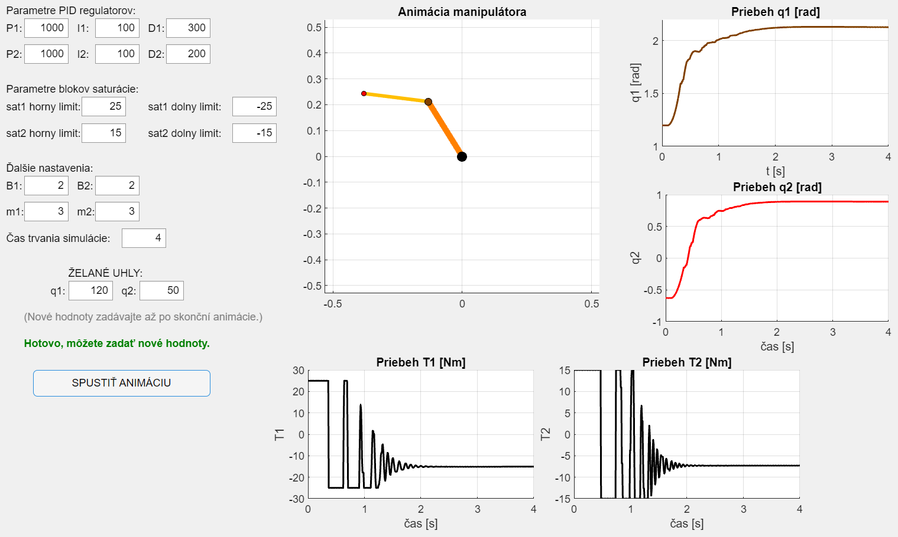
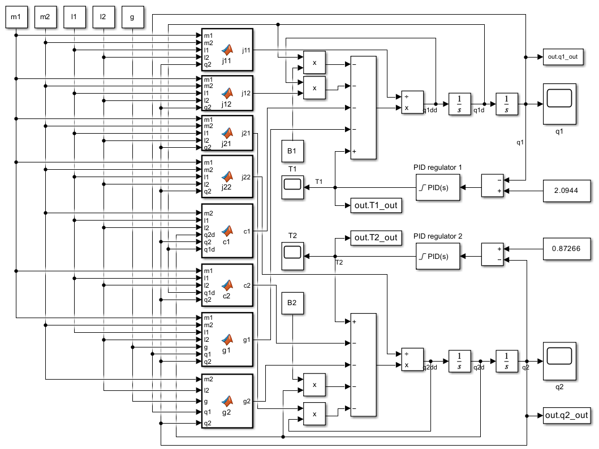

# Riadenie-a-animacia-robotickeho-manipulatora
Toto je moje vypracovanie druhého zadania z predmetu robotika. V Matlabe v Simulinku som vytvoril model, schému dvojramenného manipulátora a pomocou PID regulátora som ho riadil.
Zaujímavejšie je, že som v urobil aj interaktívnu aplikáciu, ktorá umožňuje používateľovi hrať sa s riadením - nastaviteľné sú hodnoty PID regulátora, hodnoty obmedzenia akčného zásahu, trenie v kĺboch, dĺžku ramien a hlavne želané hodnoty uhlov. Skript spúšťa simuláciu v Simulinku, berie odsimulované hodnoty a vykreľuje ich v animácii.

Tu je [video](videoAnimacieManipulatora.mp4)(7,7 MB), na ukážku ako aplikácia pracuje, pre niekoho kto nemá Matlab.

[Skript](riadenieManipulatoraAplikacia.m) v Matlabe (Pre správne fungovanie treba mať v Simulinku otvorenú simuláciu)

[Model](zad2_sim.slx) manipulátora v Simulinku.

Samotné [zadanie](RobZad2.pdf) č. 2 z predmetu Robotika.

Moja [dokumentácia](zad2_dokumentacia.pdf), kde sú moje myšlienkové pochody a proces riešenia podľa mňa celkom pekne zhrnuté.

Pre čitateľa, ktorý má málo času, tu je aspoň screenshot z aplikácie:

A screenshot modelu dvojčlánkového manipulátora s PID regulítormi v Simulinku:

